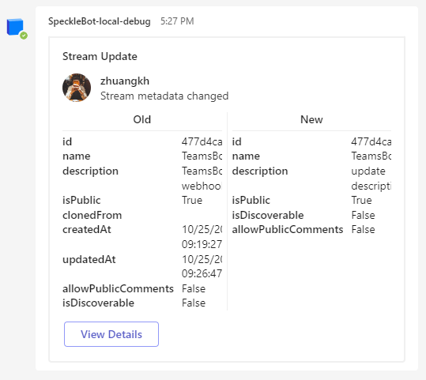
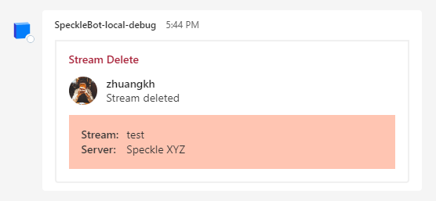
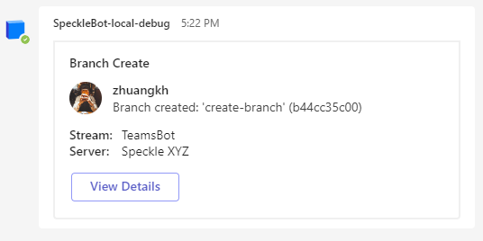
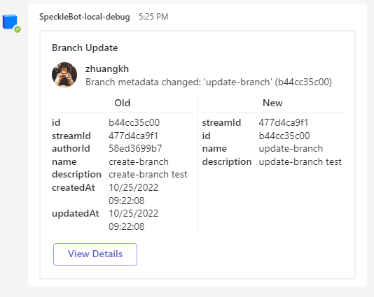
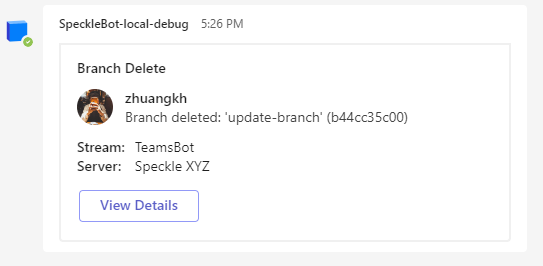
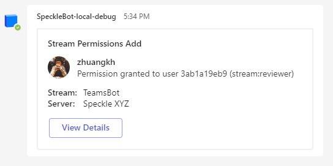
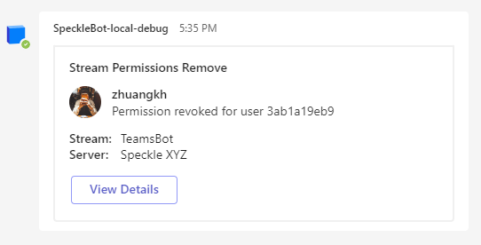

# SpeckleBot

SpeckleBot for Microsoft Teams using [speckle webhooks](https://speckle.guide/dev/server-webhooks.html)

## Webhooks

- [x] stream_update

  
  
- [x] stream_delete

  
  
- [x] branch_create

  
  
- [x] branch_update

  
  
- [x] branch_delete

  
  
- [ ] commit_create
- [ ] commit_update
- [ ] commit_delete
- [ ] commit_receive
- [ ] comment_created
- [ ] comment_replied
- [ ] comment_archived
- [x] stream_permissions_add

  
  
- [x] stream_permissions_remove

  
